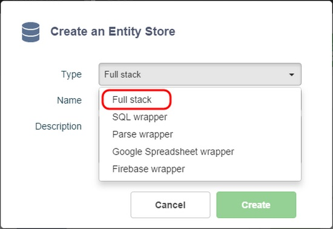
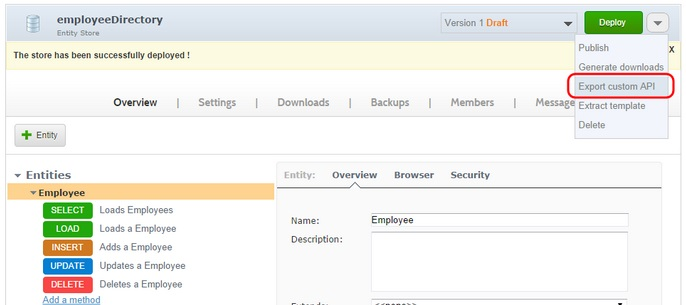
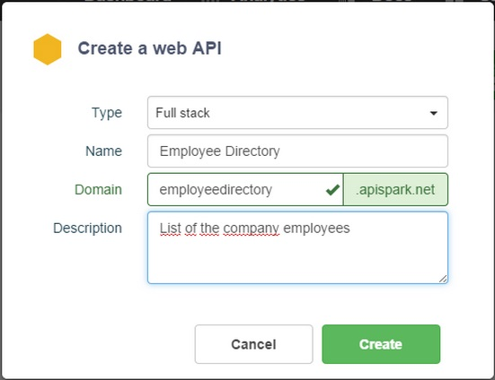
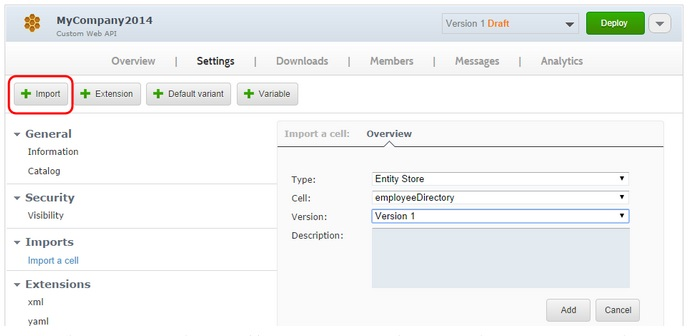

#Export an API from a Data Store

If you have no data yet to surface, we suggest you start by creating local data on APISpark and then surface them.
##Create Local Data on APISpark
As an API needs resources, we want to create a local Data Store where the API will find the necessary resources. If you already have an existing data source, you can directly create your API and import your existing Data Store (see Create an API and import a Data Store). 
APISpark allows you to create two types of Data Stores: Entity Stores (data) and File Stores (documents). For more information, see Local Data Stores.
In this example, we create an Entity Store.

1. Open your APISpark **Dashboard** and click on the **+ Entity Store** button.

2. In the **Create an Entity Store** window, select the appropriate Entity Store type (here **Full Stack*).

3. Enter a Name and a Description and click on the Create button.
4. Click on the + Entity button and give it a name (here “Employee”).
5. To add properties manually, click on the Add a Property link and add as many properties as needed. In this window you can add a data type, cardinality and default value.
6. Click on the Deploy button to deploy your Entity Store. Wait until a message informs you that it has been deployed successfully.
7. To add an entity, click on the Browser tab and click on the Add button.
8. Fill in the different fields and click on Add.
> **Note:** If you add entities, you need to re-deploy your Entity Store to display them in the browser.
> 
##Create a Web API from a Data Store
1. From your Entity Store, click on the action arrow and select **Export custom API**.

2. In the **Create a Web API** window:
 - Enter the **Name** for your API.
 - Your domain name is automatically suggested in the **Domain** field according to the name you entered. If the domain address is not available, a red cross displays on the right of the domain address. You need to find another domain address. If the domain name is available, a green tick displays on the right of the domain address.
 - Enter a **Description** of your API.

3. Click on the **Create** button. A message informs you that your API has just been created.

> **Note:** Your API is created and your entity store is imported into your API. Your Entity store’s resources are added automatically.

4. Click on the **Deploy** button to deploy your API.
#Create a Web API and import an existing Data Store
##Create a Web API
1. Open your APISpark **Dashboard** and click on the **+ Web API** button.

2. In the **Create a Web API** window:
 - Select **Full Stack** in the **Type** drop-down menu.
 - Enter the **Name** of your API.
 - Your domain name is automatically suggested in the **Domain** field according to the name you entered. If the domain address is not available, a red cross displays on the right of the domain address. You need to find another domain address. If the domain name is available, a green tick displays on the right of the domain address.
 - Enter a **Description** of your API.

3. Click on the Create button. A message informs you that your API has just been created.
##Import an Existing Data Store
###via the Export custom API feature
You can expose existing data by creating a Data Store and exporting a custom API.
 
1. From the **Dashboard**, open your Data Store.
2. Click on the Action drop-down menu and select **Export custom API**.

3. The **Create an API** window displays:
	
	- Select **Full Stack** in the **Type** drop-down menu.
	- Enter the name of your API in the **Name** field.
	- Your domain name is automatically suggested in the **Domain** field according to the name you entered. If the domain address is not available, a red cross displays on the right of the domain address. You need to find another domain address. If the domain name is available, a green tick displays on the right of the domain address.
	- Enter a description of your API in the **Description** field.

	> **Note:** You are creating a new Web API and importing your Entity store with its resources (deselect the Add resources automatically checkbox if you do not want to add the entity store resources).

4. Click on the **Create** button. A message informs you that your API has just been created.
###via the Import Ressources feature 
You can also expose data by creating an API first and importing one or several data stores. If you need to import several data stores, we advise you to follow this process.

1. From your **Dashboard**, create a web API (or open an existing one)
2. Click on the **Settings** tab.
3. Click on the **+ Import** button.

4. In the **Overview** Section, select the **Type** of resource, the **Cell** and the **Version** you need to add.
5. Click on the **Add** button.
6. Click on the **Add resources** button to import the cell content.
7. Click on the **Overview** tab to check if the resources display.
