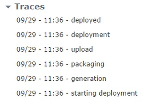

Every APISpark cell is present in two different environments.

The **APISpark web IDE** is the development environment in which you design and maintain your cells.

When you deploy a cell, APISpark generates a program that will be deployed in the cloud and executed in the **APISpark runtime environment**.

Thus, your Data Stores and Web APIs are only available to store data or receive HTTP requests after having been deployed.

Cells can be deployed from the draft, published and deprecated states, and can be re-deployed at any time.

<!-- TODO center -->

The deployment process is composed of several steps:

1. Your cell model is checked.  
2. Code is generated  and compiled for your cell.  
3. Your cell is actually deployed on the APISpark infrastructure.

Once you have clicked on the **Deploy** button, you can follow the different steps of the process in the information window that displays.

You can also check the deployment process of your cells in the **Messages** page: from your **Dashboard**, open the appropriate cell and click on the **Messages** tab. Events are listed in the **Traces** section.

