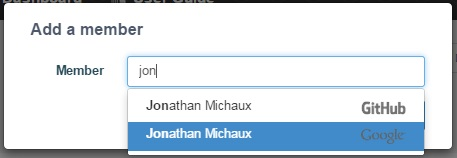

# Introduction

APISpark is built to support team-based collaboration on API projects.

Collaboration in APISpark is based on the capacity to share a cell with other APISpark users, and to attribute specific roles to collaborators based on the functions they carry out.

# Cell Roles

A member can have one of five roles on a cell.

For team-based collaboration, members should be given either of the roles Owner, Manager, Operator, or Developer.

User is a special role designed for web API members who are consumers of your API. For more information about managing your API consumption, please visit the [User Groups](/publish/secure/user-groups "User Groups") page.

Depending on the role given to a member, he will have different permissions in the APISpark console.

## Team roles

 * **Owner:** a cell's Owner has full rights on it. Each cell has a unique owner, who is also the owner of every version of the cell. The Owner's role cannot be modified.

 * **Manager:** a manager has all but a few rights on a cell. For instance, a manager can't delete a cell, as this operation is reserved to the Owner.

 * **Operator:** an operator has the rights to manage runtime aspects of a cell, to manage a cell's lifecycle, and to manage the community of cell members.

 * **Developer:** a developer has rights to the design-time and development aspects of a cell.

## Consumer roles

 * **User:** a user can consult basic information about a Web API and be given runtime access rights by being added to a member group.

# Managing cell members

To manage the members of a cell, navigate to the cell's **Members** tab.

From here, you can add and delete members, and attribute roles to members.

You can search for members, **TODO** ...

# Switch role perspective

Coming soon.
