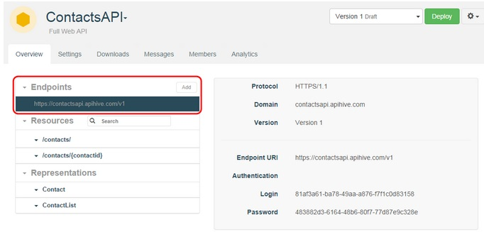

# Endpoint basics

An **Endpoint** is the entry point for accessing a web API, to which all the API's resources are attached.

An **Endpoint** has a **URI** (Uniform Resource Identifier), a **Protocol**, a **Domain**, a **Version**, and **Authentication** credentials.

A single API can have multiple endpoints, for example to respect different naming conventions or to support different protocols such as HTTP or HTTPS.

To edit a web API's endpoints in APISpark, navigate to the Web API's **Overview**. The API's endpoints are listed in the **Endpoints** section in the left panel.

To add new endpoints, click on the **Add** button of the **Endpoints** section.

You will be prompted to select a **Domain** and a **Protocol** for you new **Endpoint**.

# Custom domains

Custom domains can be used as a basis for you API endpoints.

*Coming soon*.
