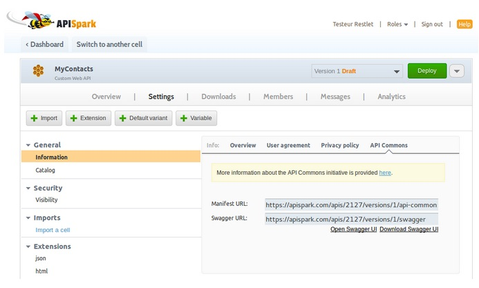

#Author & license

In APISpark, you can find information about author and license.

In the **Settings tab**, select **Information** in the **General** section. Click on the **Overview** tab.

#Sharing an API design - API Commons

Once your web API has been designed, implemented and deployed, you can share it in the commons and participate in the effort for better API patterns. By sharing your design copyright free, you will enable other API providers to reuse it and set standards for APIs, facilitating the work of API users, plus you will take a stance as the provider of the API. The [API Commons](Sharing an API design - API Commons) initiative is just aimed at providing a service for this purpose.

To register your Web API on API Commons, you need to provide a JSON file. This file is auto-generated by APISpark and can be retrieved in the **Settings** page:

In the **Settings** tab, select **Information** in the **General** section. Click on the **API Commons** tab. You can file the file in the **Manifest URL** field.

You can then go to [this page](http://apicommons.org/add-apis.html) to get instructions on how to use the api commons manifest file to index your API.

