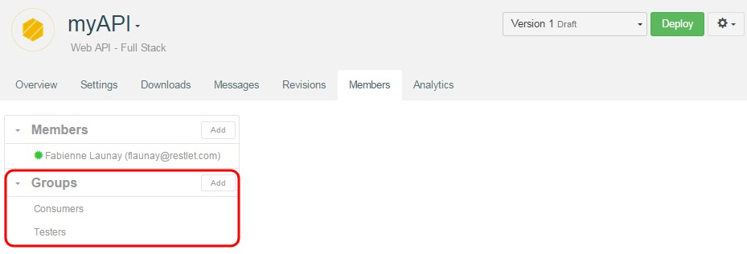

# Introduction

APISpark provides a highly flexible system for controlling runtime access to your APIs.

Runtime access means controlling which of your API's methods can be invoked by which the API's consumers. You can decide to put in place very simple rules, for example by giving all your API's consumers the same access rights, or you can fine tune access to your APIs for different groups that you can define. You can also configure your API methods to be open to anyone without authentication.

Runtime access permissions to APISpark APIs are defined by assigning method access rights to member groups.

You have the choice to build the member groups that correspond to your needs. For example, you might create a group to which you will give read-only rights on your API, and another to which you will give read-write access.

Alternatively, you might create groups for specific categories of users, depending for example on the rate limitation you wish to apply (see the [Rate Limitation](apispark/guide/secure/rate-limitation "Rate limitation") page on how to configure rate limitations).

When you create a new web API, two default groups will be created: **testers** and **consumers**. As the API creator, you will automatically be added to the **testers** group so that you can invoke and test your API. The **consumers** group is designed for the consumers of your API.

Of course, you can freely edit your API's member groups and delete the default ones if you wish.

# Managing web API groups

1. Open your API.
2. Click on the **Members** tab.
3. In the **Groups** section, click on the **Add** button.

	

4. In the **Add group** window, enter the name and description for your group. The new group displays in the **Groups** section.

	

# Managing group members

You can manage a group's members by selecting the group from the left panel of the **Members** tab.

Add members to a group by clicking on the **+ Add a member** button of the selected group.

> Note: you can only add a member to a group if he has already been added as a member of you API. The process of adding member to any cell is described in the [Team Work](apispark/guide/explore/team-work "Team Work") page.

## Set your consumer members' role to User

Cell members destined to consume your API should be given role *User*. This means the member will be able to consult the API's documentation, but won't be able to modify the API in any way.

By default, new members are given role *User*.

# Configure runtime access for groups

Runtime access to an API is configured by allowing specific resource methods for specific groups.

## Configure method level access

Select a method belonging to one of the resources in the left panel of a web API's **Overview**. Open the method's **Security** tab in the central panel.

The **Security** panel lets you decide which methods are open to which member groups for this specific resource.

## Configure default permissions

Default permissions allow you to define group/method permissions once and for all. Every new resource created will then inherit these default permissions.

To configure default permissions for an API, go to the **Settings** tab, and select **Default Permissions** from the left panel.

## Opening a method to anyone

API methods can be opened to *anyone*. A method opened to *anyone* can be invoked without authentication.

To configure a method's runtime access to *anyone*, in either method-level or default permissions, check *anyone* in the appropriate menu.

> Note: you will need to redeploy your API in order to take into account changes in groups and permissions.
