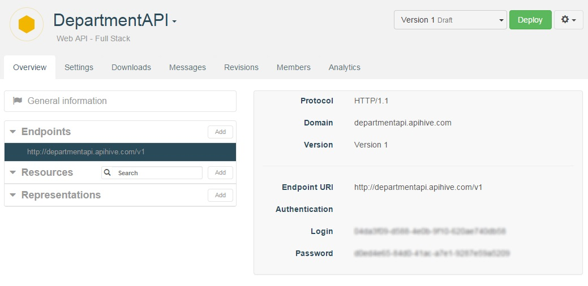

# Accessing an API

APISpark web APIs are either *public* or *private*. This affects the way you access the web API's documentation, including access tokens, but does not have an affect on invoking the API at runtime.

## Access a private API

In order to browse a private web API's documentation and get your access tokens, you need to be a member of the API. To see how to create web API members, please visit the [User Groups](apispark/guide/publish/secure/user-groups "User groups") page.

Navigate to the API's overview. If you are a member of the API, it will appear in your **Dashboard**.

Select an Endpoint in the left panel. The central panel displays your access tokens.

## Access a public API

Public web APIs can be browsed by anyone, without authentication. To see how to configure a public web API, please visit the [Public and private APIs](/publish/secure/public-and-private-apis "Public and private APIs") page.

A public API is not necessarily open to anyone at runtime. This is configured from the [User Groups](apispark/guide/publish/secure/user-groups "User groups") page.

## Basic authentication access tokens

To view your security tokens to access an API, select an Endpoint from the list in the left panel of the **Overview** tab. The central panel displays your access tokens.

# Invoke an API

In order to invoke an API, you must belong to one of the API's consumer groups with sufficient runtime permissions.

However, some APIs are open to anyone without authentication.

To see how to configure a web API's runtime permissions, including opening an API to *anyone*, please visit the [User Groups](apispark/guide/publish/secure/user-groups "User groups") page.

## Make an HTTP call

APISpark web APIs respect the principles of REST. Therefore, CRUD operations can be performed on resources exposed by the API.

## Query parameters

Entity stores exposed through a web API support a rich query language for collection resources. The query language is based on a set of special parameters that are passed as query parameters in HTTP GET requests on collection resources.

### Sorting

The *sort* query parameter is used to sort results in either ascending or descending order based on the value of a property. Multiple sort criteria can be used simultaneously.

`GET https://myapi.apsipark.net/v1/employees/?sort=age ASC`

In this request, we sort the collection of employees according to their age in ascending order. Descending order is used by replacing "ASC" with "DESC".

    {
    "list": [
    {
    "id": "2345",
       "name": “Roy”,
       “age”: 40
         “address”:{
      "id": "4567",
         "value": “123 Happy Street, Happy Land”
     },
     {
    "id": "3456",
       "name": “Ada”,
       “age”: 54,
         “address”:{
      "id": "5678",
         "value": “234 Funky Road, Funky Town”
      }
    ]
    }

### Pagination

In case you have many organizations stored in your entity store, you may not want to read them all at once. The *page* and *size* query parameters let you specify the size of a page, and which page to load.

`GET https://myapi.apsipark.net/v1/organisations/?page=4&size=100`

### Load Strategy

The load strategy is used to define whether or not to load data references, and if so at what depth.

The strategy query parameter can take values load or reference, and reference is used by default.
If a load strategy is specified, the depth parameter indicates at which depth related data should be loaded.

Example data model: An Organisation has Employees which each have an Address.

#### Example 1

`GET https://myapi.apsipark.net/v1/organisations/?strategy=reference`

In this request, the list of organizations is loaded, and all the values of primitive type properties are also loaded (e.g. name). Employees are only loaded by reference.  

    {
    "list": [
    {
     "id": "1234",
     “name”: “Restlet”,
    "employees": [
    {
    "id": "2345",
       "name": null,
         “address”:null
    },
    {
    "id": "2345",
       "name": null,
         “address”:null
    }
    ]
    }
    ]
    }

#### Example 2

`GET https://myapi.apsipark.net/v1/organisations/?strategy=load`

In this request, in which the *depth* parameter is set to its default value 1, organisations are loaded along with the first level of related data, therefore the values of primitive type fields of employees are also loaded.

    {
    "list": [
    {
    "id": "1234",
     “name”: “Restlet”,
    "employees": [
    {
    "id": "2345",
       "name": “Roy”,
         “address”:{
      "id": "4567",
         "value": null
      }
    },
    {
    "id": "3456",
       "name": “Ada”,
         “address”:{
      "id": "5678",
         "value": null
      }
    }
    ]
    }
    ]
    }

#### Example 3

`GET https://myapi.apsipark.net/v1/organisations/?strategy=load&depth=2`

In this request, in which the *depth* parameter is set to 2, organizations are loaded along with the first level of related data (employees) along with the third level of related data (employee addresses).

    {
    "list": [
    {
    "id": "1234",
     “name”: “Restlet”,
    "employees": [
    {
    "id": "2345",
       "name": “Roy”,
         “address”:{
      "id": "4567",
         "value": “123 Happy Street, Happy Land”
      }
    },
    {
    "id": "3456",
       "name": “Ada”,
         “address”:{
      "id": "5678",
         "value": “234 Funky Road, Funky Town”
      }
    }
    ]
    }
    ]
    }
