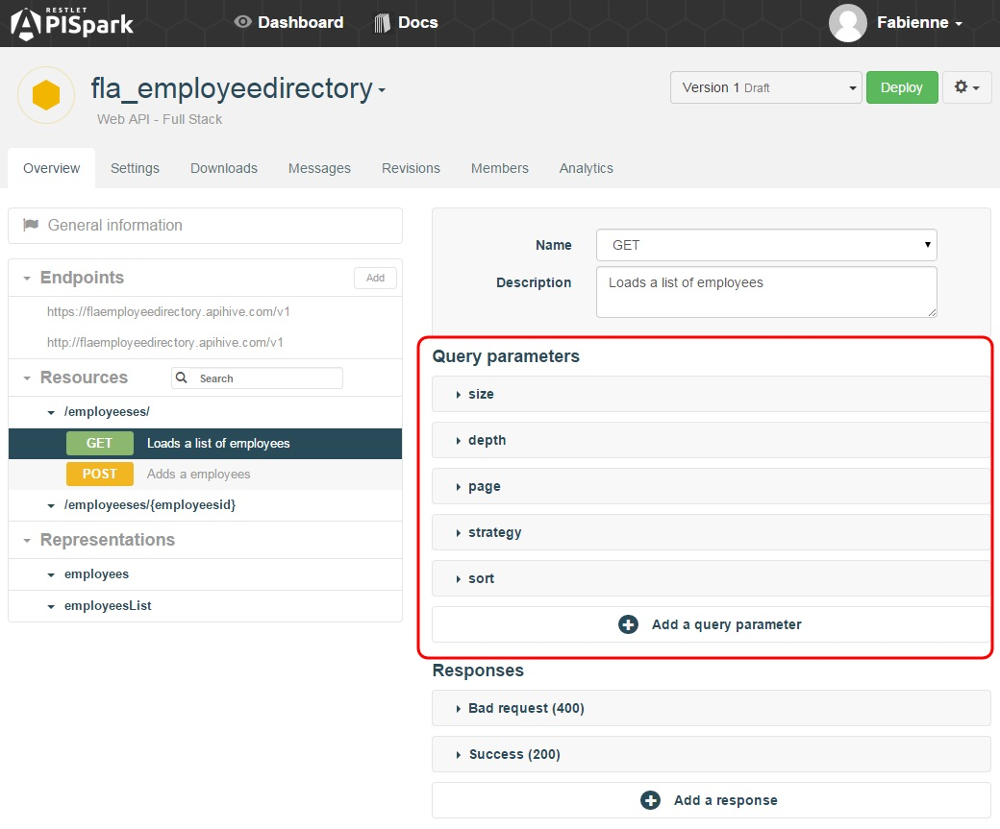

APISpark proposes 2 types of Data Stores: 

* local Data Stores for which data is hosted / backuped and operated by APISpark teams and 
* wrapped stores for which data are hosted externally (SQL Wrapper, Google spread Sheet Wrapper)...

We distinguish 2 types of local Data Stores: 

* Entity Stores (structured data)
* File Stores (static files)

An Entity Store allows you to store structured data (equivalent to a database). You start by creating Entities and you can express relations between Entities.

Entity stores exposed through a web API support a rich query language for collection resources. The query language is based on a set of special parameters that are passed as query parameters in HTTP GET requests on collection resources. More information on [Query parameters](03_create/03_edit/03_resources.md "Query parameters").

