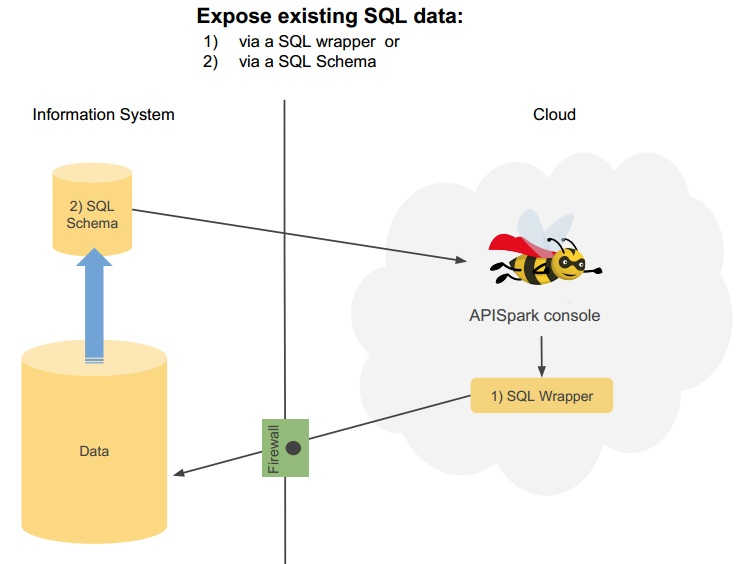
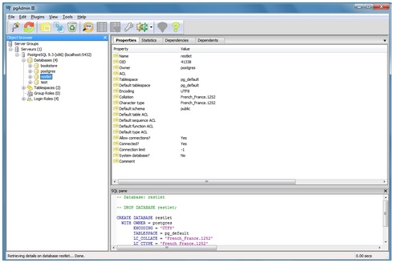
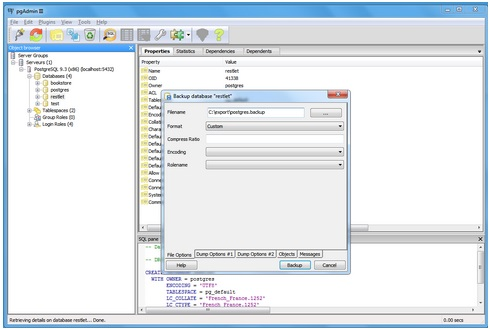
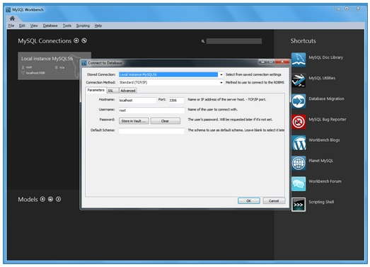
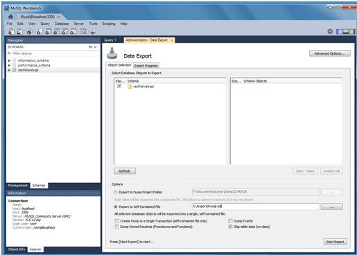
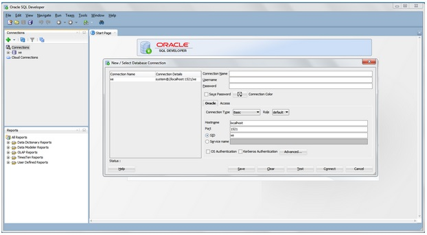
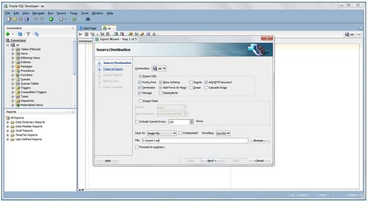
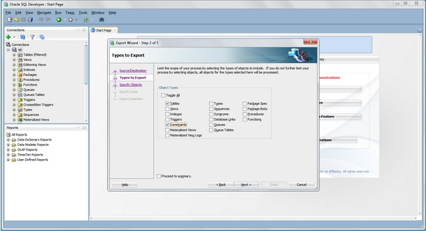

If you need your API to get data from your existing SQL database, your firewall may prevent APISpark from connecting to this database. To solve this secure access issue, you can extract a SQL Schema from your database and import it in APISpark. The databases (and tools) supported are PostgreSQL (pgAdmin, pg_dump), MySQL (Mysql Workbench, mysqldump) and ORACLE (SQL Developer).

# Extract your SQL Schema from your database
You only need a database structure with tables and constraints definitions to import your schema in APISpark.  
Generate a DDL or SQL file following the appropriate database and tool instructions below.

## using PostgreSQL

### with pgAdmin

1. From pgAdmin, open a connection to your database.
2. Select the database schema you want to export in the tree browser.

  

3. Click on the **Tools** menu and select **Backup**.
4. In the **Backup database** window:

  

  * Filename: Define the output file name.
  * Format: Plain.
5. Click on the **Backup** button to generate the output “.backup” file.
6. Click on the **Done** button to close the **Backup database** window.

You can import the “.backup” file generated in APISpark.

### with pg_dump

1. Open a terminal.
2. Run the following command:
  * On Linux
    * [postgresql_home]\pg_dump -Fp -s -U [user] --file="[output.sql]" [schema]
  * On Windows
    * [postgresql_home]\pg_dump.exe -Fp -s -U [user] --file="[output.sql]" [schema]
3. Replace the square brackets [] content with:  
  * [postgresql_home] : Install directory of PostgreSQL  
  * [user] : User name  
  * [output.sql] : Path and name of the output SQL file  
  * [schema] : Database schema to export

## using MySQL

### with MySQL Workbench

1. From MySQL Workbench, open a connection to the database:
  * Click on the **Database** menu and select **Connect to Database**.
  * In the **Connect to Database** window:
    * Define connection parameters
    * Click on the **OK** button to open the connection to the database

  

2. Click on the **Server** menu and select **Data Export**.
3. In the **Data Export** window:

   

  * In the **Object Selection** tab:
    * Select the schema that you want to export
  * In the **Options** section:
    * Select **Export to Self-Contained File**
    * Define the output SQL file
    * Select **Skip table data**
  * Click on **Start Export** button to generate the SQL file.

You can use this SQL file on APISpark.

### with mysqldump

1. Open a terminal.
2. Run the following command:
  * on Linux:
    * [mysql_home]/mysqldump [schema] > [output.sql]
  * on Window:
    * [mysql_home]/mysqldump.exe [schema] > [output.sql]

Replace the square brackets [] content with:  
  * [mysql_home]: Install directory of MySQL  
  * [schema]: Database schema to export  
  * [output.sql]: Path and name of the output SQL file

## using Oracle

### with SQLDeveloper

1. Run Oracle SQL Developer and connect to your database.

   

2. Export your database:
  * Click on the **Tools** menu and select **Database export**.

3. In the **Export wizard Step 1 of 5** window, define these values:

    

  * Connection: Specify the database connection that we have just created before.
  * Select the **Export DDL** checkbox.
  * Do not select the **Export Data** checkbox.
  * In **Save as** drop-down menu, select **Single file**.
  * Specify output SQL file name and path.
  * Click on the **Next** button.

5. In the **Export wizard - Step 2 of 5** window, define:

    

  * Select the **Toggle All** checkbox.
  * Only select the **Tables** and **Constraints** checkboxes.
  * Click on the **Next** button.

6. In the **Export wizard - Step 3 of 5** window:

  * Select the tables of your database that you want to export.
  * Click on the **Next** button.

7. In the **Export wizard - Step 4 of 5** window:

  * Click on the **Next** button.

8. In the **Export wizard - Step 5 of 5**  window:

  * Click on the **Finish** button.

9. SQL Developer generates the SQL file which will be imported in APISpark.

You can import the generated SQL file in APISpark.

# Import your SQL Schema in APISpark

You can import the SQL file generated by the database tool in APISpark to add new entities for each exported table.

## Use an Entity store

The DDL/SQL file contains information about database schema and allows APISpark to create entities for each database table.
To import the DDL/SQL file, you must use an existing Entity Store:

1. Open an existing Entity Store or create a new Entity Store.
2. Click on the actions button and select **Import SQL file**.

    

3. Select your SQL file.
4. Click on the **Import** button.

## Entities creation

APISpark reads SQL orders in the import file. Entities are automatically created from each table in the SQL schema file specified.

> **Note:**
> Composite primary keys are ignored and are replaced by a new column named “id” which will be the primary key of this entity
> If no primary key is defined in the table, the corresponding entity will have a new column named “id” which will be its primary key, because primary key is mandatory for each entity in APISpark.
> Foreign keys on some columns are ignored, only foreign keys on one column are supported

At the end of the import, APISpark displays a confirmation message indicating the success or failure of the import.

## Import details

Click on the **Messages** tab to get more details about the import.

## Leverage the Entity Store
You can adapt the generated entities of the entity store to your needs by:
* adding more fields
* modifying field type
* adding default values
* adding constraints, like not nullable, foreign key or primary key

# Appendix: Supported SQL features and syntax

## Supported SQL syntax by database export tool

The following table contains SQL features which can be read by APISpark in the SQL file exported by the database tool.

| Database/Export tool | Column name | Column type | Primary key | Foreign key | Not nullable column
| :---: | :---: | :---: | :---: | :---: | :---: |
| **Oracle/ SQL Developer** | X | X | X | X |  |
| **PostgreSQL/pgAdmin** | X | X | X | X | X
| **PostgreSQL/pg_dump** | X | X | X | X | X
| **MySQL/MySQL Workbench** | X | X | X | X | X
| **MySQL/mysqldump** | X | X | X | X | X

## Supported SQL syntax in the SQL file
The supported SQL statements in the SQL file are:

* CREATE TABLE …
* ALTER TABLE [table] ADD CONSTRAINT [constraint_name] PRIMARY KEY …
* ALTER TABLE [table] ADD CONSTRAINT [constraint_name] FOREIGN KEY …
* ALTER TABLE [table] ADD PRIMARY KEY …
* ALTER TABLE [table] ADD FOREIGN KEY …

## Primary key

* Primary keys with only one column are supported.
* If a primary key has more than one column, this primary key is ignored and is replaced by an “id” column in the Entity Store which will be the primary key.
* If the table has no primary key, a new property named “id” is created in the - Entity Store and will be its primary key.

## Foreign key

* Foreign keys with only one column are supported.
* If a foreign key has more than one column, this foreign key is ignored.
