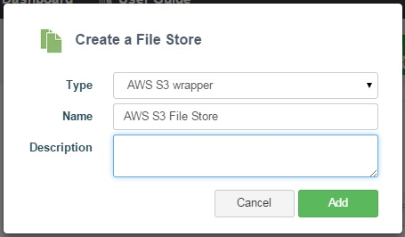
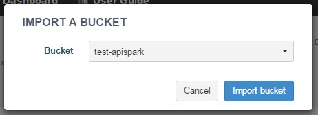
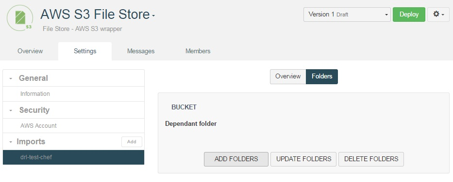

# Introduction

APISpark features a Wrapper File Store for Amazon [AWS S3](http://aws.amazon.com/s3/) buckets. The S3 Wrapper  lets you serve and store files from existing S3 buckets through a web API.

This guide doesn't explain how to configure AWS S3, but simply lists the information you'll need to collect from your AWS administrator in order to configure APISpark.

>**Note:** You will need your AWS access key ID and secret access key to be able to use your AWS S3 account.

# Configure your S3 File Store Wrapper

Click on the **+File Store** button, select **AWS S3** as a Type and fill in a name e.g. *AWS S3 File Store* for your store.

Click on the **Settings** tab and from the **Security** section, select **AWS Account**.

Enter your **Access Key ID** and **Secret Access Key** and click on the **Test** button.

When connected, APISpark automatically detects all buckets for which you have access.

In the **Imports** section, click on the **Add** button. From the **Bucket** drop-down menu, select the bucket you want to import and click on the **Import bucket** button.

Click on the **Folders** tab and on the **Add folders** button to create the associated folders.

If your bucket contains several root folders, associated folders are created for each of them. You can then explore the folders individually by clicking on them.

# Use your File Store Wrapper

Click on the **Deploy** button.

Once your File Store has been deployed, you can simply export it as a new web API via the actions button or import it from an existing web API. For more details on how to do this, please check out our [tutorials](technical-resources/technical-resources/apispark/tutorials "tutorials").
