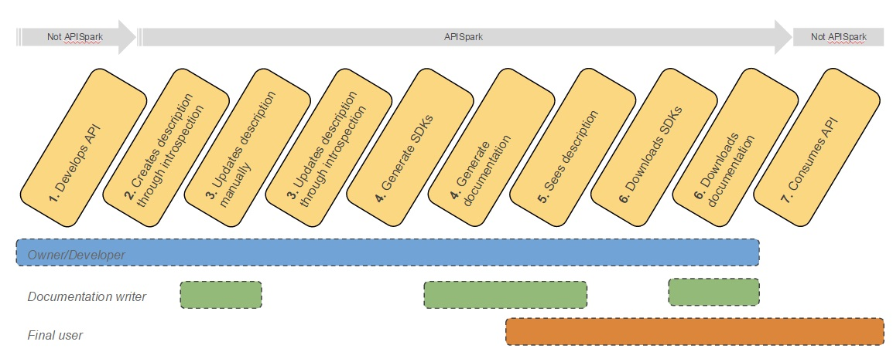

APISpark can enhance the way you document an existing web API hosted outside the APISpark platform.

# Enhanced API documentation

APISpark can help you document an existing API in the following ways:

* Automatically generate [*documentation*](technical-resources/apispark/guide/document/get-documentation "Generate documentation")
* Automatically generate [*client SDKs* and *server skeletons*](technical-resources/apispark/guide/document/get-documentation "Generate client SDKs and server skeletons")
* Automatically generate *standard API definitions* (RAML, Swagger) for [third-party Integration](technical-resources/apispark/guide/publish/publish/third-party "Third-party Integration") integration

# The web API Descriptor

A web API *Descriptor* is an APISpark cell that documents a web API. Many features are then accessible via the Descriptor.

You may [create a web API Descriptor](technical-resources/apispark/guide/store/entity-stores/overview "create a web API Descriptor") by introspecting existing code (Restlet framework, JAX-RS) or by importing an existing web API definition in the Swagger format, or manually.

Similarly, an APISpark Descriptor can be automatically translated to the Swagger or RAML formats.

A Descriptor can be edited by members of the team that provide the described API. On the other hand, the Descriptor can be consulted by consumers of the API, who can also benefit from the elements derived from the Descriptor such as client SDKs.

# The process of documenting your external API

Here is a summary of the process that allows you to document an existing API using APISpark's *Descriptor*:

* Develop web API (outside the APISpark platform)  
* Create a Descriptor by introspection, or by importing a Swagger definition  
* Maintain the Descriptor either by hand or automatically via introspection  
* Generate documentation and SDKs for your API consumers to download

In the following sections, we will show you how to manually create and edit a web API Descriptor. Then we will explain how to automatically generate a web API Descriptor from your existing web API implementation.

<!-- TODO could also document the API first and develop the web API after with the server skeleton. -->

