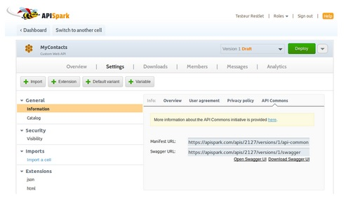
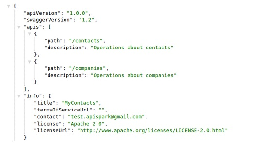
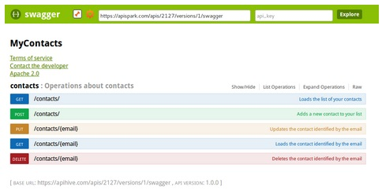
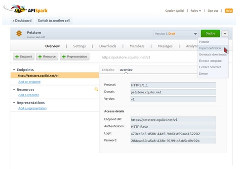
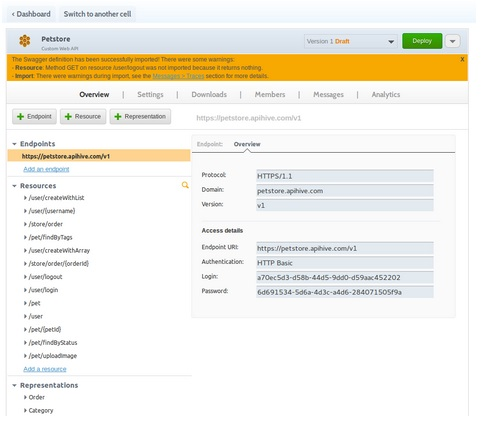
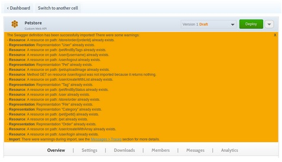

#Introduction

Swagger is an API description language that comes with number of tools including Swagger UI and Swagger Code Generator. Swagger UI provides a nice HTML presentation of your API’s contract and allows you to test your API by calling it. Swagger Code Generator generates client kits for your API in eight languages.

APISpark dynamically generates the Swagger description of web APIs and provides the Swagger UI and Code Generator capabilities as a service. You can also import an existing Swagger description into APISpark to update a Web API contract.

#Get the Swagger definition of your API

Select the web API you want to get the Swagger definition of.

Open the **Settings** tab and click on the **Information** section, then on the **API commons** tab in the center pane.

The Swagger definition of your API is hosted on the address specified by the  **Swagger URL** field.

#Check out its Swagger UI

On the same tab as previously, you can either download a local version of Swagger UI with the button **Download Swagger UI** or just open it on APISpark with the   **Open Swagger UI** button.

#Import existing Swagger definitions

You can import a web API’s contract to APISpark using its Swagger definition just by providing the URL on which it is available to APISpark.
From an existing API page, click on the actions button on the top right to open the drop-down menu, then select the **Import definition** action.

You will have access to a form which you can fill in to import the representations and resources of a Swagger definition into your API.

After you click on the **Import** button, the representations and resources of the Swagger definition you provided the link to will be imported in your **Overview** tab.

If you import several definitions you may have conflicts, multiple resources on the same path or multiple representations with the same name. The import wizard will display a message in an orange panel and you will be free to solve the conflicts by yourself. 

If you close the panel, you can still find the traces in the Messages section, in the Traces tab in the left pane.

