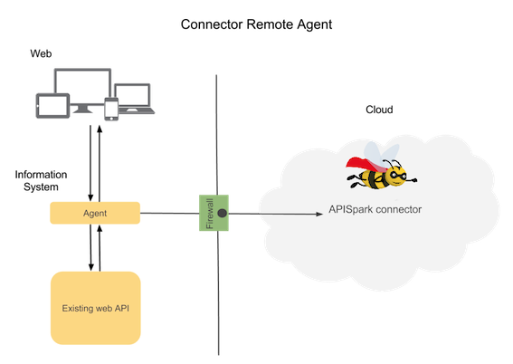
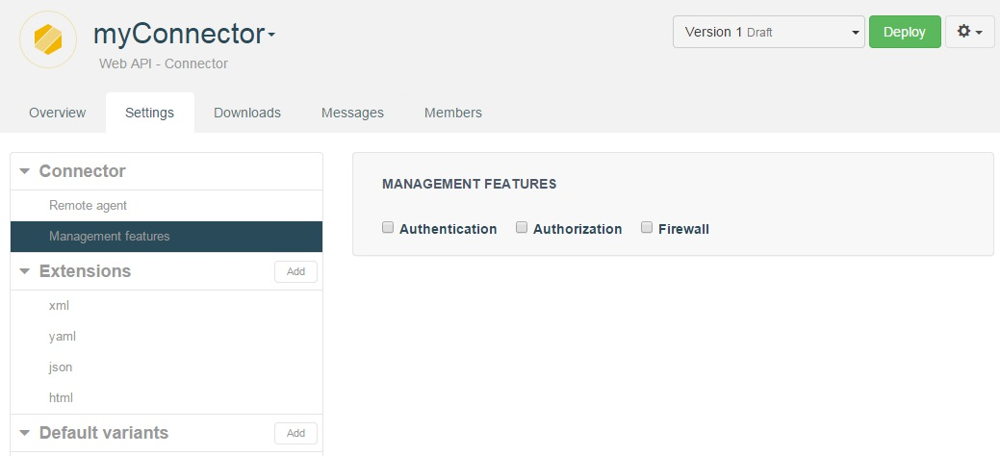
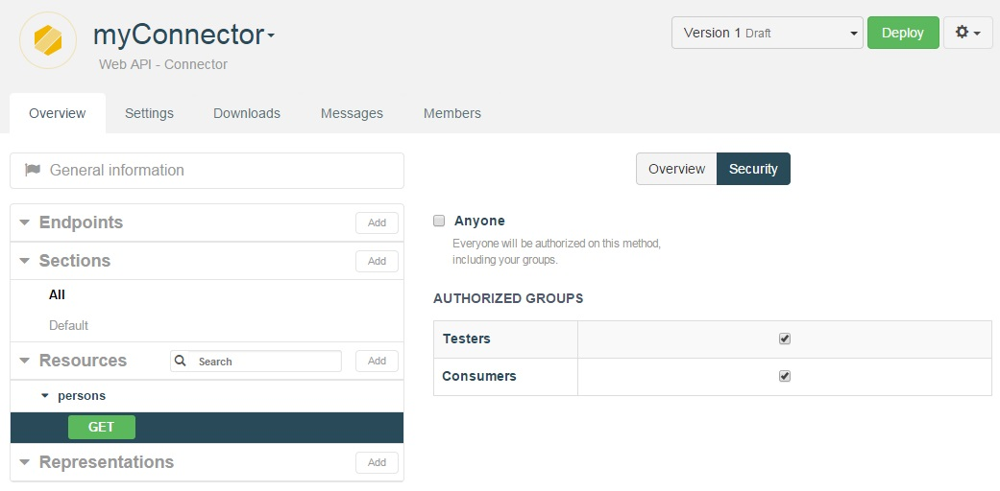
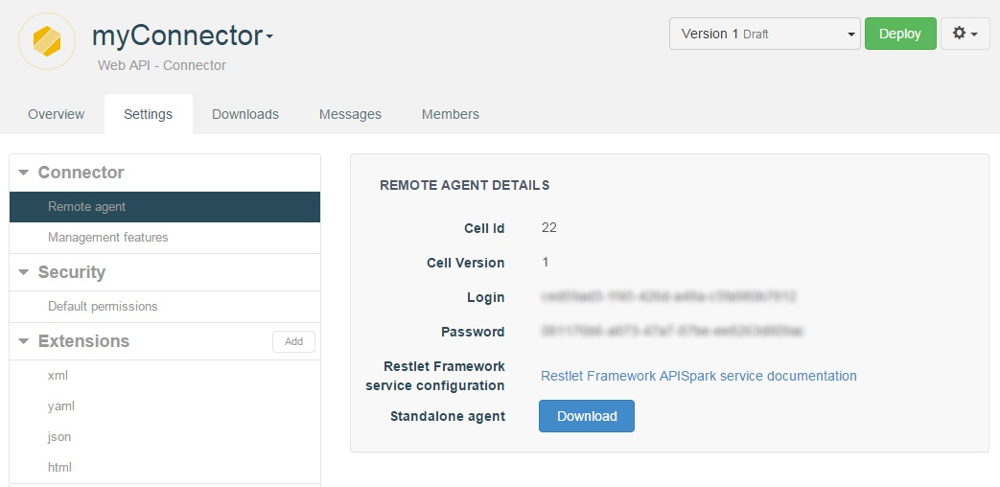

APISpark can bring additional features to your existing web API hosted outside of APISpark with the *Connector* cell.

With a *Connector*, you can add to your API:
* Authenticated access
* Fine-grained Access Control
* Rate-limitation (quotas) to your API users
* IP filtering

# How does a connector work?

To enable these features, you should add an APISpark Remote Agent in front of your API.

This agent acts as a Reverse Proxy and adds the features you have enabled in the APISpark console on the incoming requests of your API.



# Agent settings

The features used by the *Remote Agent* are defined on your APISpark Dashboard, on the *Connector* cell.

To enabled or disabled each feature:

Open the appropriate cell.  
Navigate to the **Settings** tab.  
In the **Connector** section, select **Management features**.  
Select the features you want to enable.



## Authentication module

The **Authentication** module uses the access settings defined in the **Members** tab.

For more information, jump to our [User Groups](technical-resources/apispark/guide/publish/secure/user-groups "User Groups") section.

## Authorization module

If you enable the **Authorization** module, you activate the **Default Permission** tab and the Security tab.

The **Default Persmission** section is in the **Security** section in the **Settings** tab.


To go to the **Security** tab, navigate to the **Overview** tab and select a method from the **Resources** section.



Go to the [Runtime Permissions](technical-resources/apispark/guide/publish/secure/runtime-permissions "Runtime Permissions") section to discover how to configure the access.

## Firewall module

With the **Firewall** module, you can add *Rate Limitation* or *IP Filtering* to you web API.

Read the [Firewall settings](technical-resources/apispark/guide/publish/secure/firewall-settings "Firewall Settings") page to add such rules.

## Activate your settings

When your settings are complete, you have to deploy your *Connector* configuration for activate them.

Clic on the **Deploy** button to deploy your cell. You can read the [Cell deployment](technical-resources/apispark/guide/explore/cell-deployment "Cell deployment") page for further informations.

# Install Remote Agent

In order to plug these Connector services you have to install the agent in you Information System in front of your web API application.

Follow the steps below to install the agent.

## Download the Agent

The agent is a standalone application and exists also as a Restlet Framework Service to use it embedded in a Restlet Framework application.

<!-- TODO add download link and restlet framework guide link -->

## Configure the Agent

As explain before, the APISpark Agent use the modules that you have enabled in your APISpark Console.

The Agent retrieves its settings from APISpark and you need to configure the Agent first to communicate with your *Connector* cell.

The Remote Agent is configured from a properties file wich in included in the downloaded file. This file looks like this:

```properties
agent.login=67b60a5d-c2b8-43a3-97b8-084d6ce60e10
agent.password=5dcf7dc2-a2c4-44f5-b753-c26abea2c8b5
agent.cell.id=154
agent.cell.version=1
agent.redirection.enabled=true
agent.redirection.redirectionUrl=http://localhost:8080
```

To fill-in this configuration file, go to the **Settings** tab and select **Remote Agent** in the **Connector** section.

On this page you will find the value of the property keys `agent.login`, `agent.password`, `agent.cell.id` and `agent.cell.version`.



The `agent.redirection.redirectionUrl` key should be set to the URL of your web API.

Let's see an full configuration example:

* Before you installed the agent:

  The URL `https://myapi.com` serves your local web API running on `https://192.168.10.130:8080`.

* With the agent:

  The agent is started on `https://192.168.10.131:8000`.

  Now, the URL `https://myapi.com` serves the agent on `https://192.168.10.131:8000`.

  The agent should redirect the incoming request to your local web API on `https://192.168.10.130:8080`.

  The agent configuration is:

  ```properties
agent.redirection.redirectionUrl=https://192.168.10.130:8080
  ```

With the standelone Agent, the value of the `agent.redirection.enabled` key should be set to `true`.

## Start the Agent

Once your configuration file is filled, you could start the agent with the command:

```
java -jar -DagentConfiguration=/path/to/agent.properties apispark-agent.jar
```

  > Note:
  > The agent requires a Java runtime environment 1.7 (or above).

### Change the port

By default the *Agent* runs on port number 8000. You could change the port with the `-p` option like below:

```
java -jar -DagentConfiguration=/path/to/agent.properties apispark-agent.jar -p 3000
```

### Use HTTPS

You could also run the Agent with the `HTTPS` protocol instead of the `HTTP` one with the `--https` option .

Use `--help` to have the full list of options.
